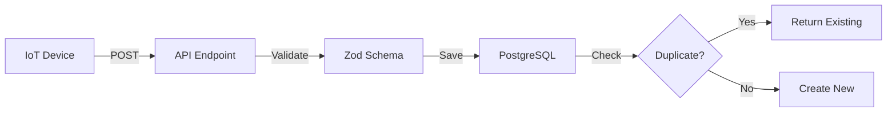
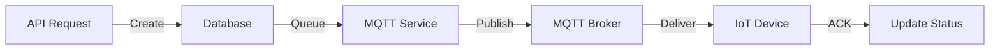

---
# Slidev Configuration
theme: default
background: https://images.unsplash.com/photo-1530836369250-ef72a3f5cda8?w=1920
class: text-center
highlighter: shiki
lineNumbers: false
info: |
  ## IoT Greenhouse Monitoring System
  Design Decisions & Architecture Overview
drawings:
  persist: false
transition: slide-left
title: IoT Greenhouse Design Decisions
mdc: true
---

# IoT Greenhouse Monitoring System

## Design Decisions & Architecture

A production-ready Node.js backend for smart greenhouse monitoring

<div class="pt-12">
  <span @click="$slidev.nav.next" class="px-2 py-1 rounded cursor-pointer" hover="bg-white bg-opacity-10">
    Press Space for next page <carbon:arrow-right class="inline"/>
  </span>
</div>

---

## layout: default

# 📋 Project Overview

<v-clicks>

- **Purpose**: Real-time IoT sensor data collection & device control
- **Domain**: Smart Agriculture / Greenhouse Automation
- **Stack**: Node.js + TypeScript + PostgreSQL + MQTT
- **Status**: In Progress 🚧

</v-clicks>

<v-click>

## Core Capabilities

</v-click>

<v-clicks>

✅ Real-time sensor data ingestion (temperature, humidity, battery)  
✅ Device command management with MQTT  
✅ Time-series data storage with PostgreSQL  
✅ RESTful API with input validation

</v-clicks>

---

## layout: two-cols

# 🎯 Tech Stack Selection

## Why These Technologies?

<v-clicks>

### TypeScript

- **Type Safety**: Catch errors at compile-time
- **Better IDE Support**: IntelliSense & auto-completion
- **Maintainability**: Self-documenting code

### Express.js

- **Lightweight**: Minimal overhead
- **Mature Ecosystem**: Battle-tested
- **Flexibility**: Easy to extend

</v-clicks>

::right::

<v-clicks>

### TypeORM

- **Type-safe Queries**: TypeScript integration
- **Migration Support**: Version control for DB
- **Active Records**: Elegant entity models

### PostgreSQL

- **JSONB Support**: Flexible raw data storage
- **Reliability**: ACID compliance
- **Performance**: Excellent for time-series

### MQTT

- **Lightweight**: Perfect for IoT
- **Pub/Sub Pattern**: Decoupled architecture
- **Real-time**: Low-latency messaging

</v-clicks>

---

## layout: default

# 🏗️ Architecture Decisions

## 1. Migration-Based Schema Management

<v-clicks>

**Decision**: Use TypeORM migrations instead of `synchronize: true`

**Rationale**:

- ✅ **Production Safety**: No accidental schema changes
- ✅ **Version Control**: Track database evolution
- ✅ **Repeatability**: Same schema across environments
- ✅ **Rollback Support**: Easy to revert changes

</v-clicks>

<v-click>

```typescript
// ❌ Don't do this in production
synchronize: true  // Dangerous!

// ✅ Use migrations instead
npm run migration:generate src/migrations/AddNewFeature
npm run migration:run
```

</v-click>

---

## layout: default

# 🏗️ Architecture Decisions

## 2. Idempotent Sensor Data Endpoint

<v-clicks>

**Decision**: Prevent duplicate sensor readings using unique constraints

**Rationale**:

- ✅ **Data Integrity**: No duplicate time-series data
- ✅ **Retry Safety**: Network failures won't create duplicates
- ✅ **Simplicity**: Database handles deduplication

</v-clicks>

<v-click>

```typescript
// Unique constraint on (device_id, timestamp)
@Entity()
export class SensorReading {
  @Column()
  deviceId: string;

  @Column({ type: 'timestamptz' })
  timestamp: Date;

  // ... other fields
}
```

</v-click>

---

## layout: default

# 🏗️ Architecture Decisions

## 3. Zod for Input Validation

<v-clicks>

**Decision**: Use Zod instead of class-validator

**Rationale**:

- ✅ **TypeScript-First**: Type inference out of the box
- ✅ **Runtime Safety**: Validate external data
- ✅ **Better DX**: Clear error messages
- ✅ **Composition**: Easy to build complex schemas

</v-clicks>

<v-click>

```typescript
const sensorDataSchema = z.object({
  device_id: z.string().min(1),
  timestamp: z.string().datetime(),
  temperature: z.number().optional(),
  humidity: z.number().min(0).max(100).optional(),
  battery: z.number().min(0).max(100).optional(),
});
```

</v-click>

---

## layout: default

# 🏗️ Architecture Decisions

## 4. MQTT for Device Communication

<v-clicks>

**Decision**: Use MQTT protocol for IoT device messaging

**Rationale**:

- ✅ **Industry Standard**: Widely adopted in IoT
- ✅ **Low Bandwidth**: Efficient for constrained devices
- ✅ **Quality of Service**: Guaranteed delivery options
- ✅ **Scalability**: Handles thousands of devices

</v-clicks>

<v-click>

**Pattern**: Command Queue System

```
API Request → Database (queued)
           → MQTT Publish to device
           → Update Status (published/error)
```

</v-click>

---

## layout: default

# 🗄️ Database Design Decisions

<v-clicks>

## Strategic Indexes

```sql
-- Fast device queries
CREATE INDEX idx_sensor_reading_device_id
  ON sensor_reading(device_id);

-- Time-range queries
CREATE INDEX idx_sensor_reading_timestamp
  ON sensor_reading(timestamp);
```

## Data Types

- **UUID**: Primary keys (distributed systems ready)
- **TIMESTAMPTZ**: Timezone-aware timestamps
- **JSONB**: Flexible raw sensor data storage
- **ENUM**: Type-safe status tracking

</v-clicks>

---

## layout: two-cols

# 📁 Project Structure

## Modular Organization

<v-clicks>

```
src/
├── config/          # Configuration
│   ├── database.ts
│   └── mqtt.ts
├── entities/        # TypeORM Models
│   ├── SensorReading.ts
│   └── DeviceCommand.ts
├── routes/          # API Routes
│   ├── sensor.routes.ts
│   └── command.routes.ts
├── migrations/      # DB Migrations
└── app.ts           # Entry Point
```

</v-clicks>

::right::

<v-clicks>

## Why This Structure?

✅ **Separation of Concerns**  
 Each layer has clear responsibility

✅ **Scalability**  
 Easy to add new features

✅ **Testability**  
 Isolated modules

✅ **Maintainability**  
 Clear navigation

</v-clicks>

---

## layout: default

# 🔐 Security Decisions

<v-clicks>

## Current Implementation

✅ **Environment Variables**: Secrets in `.env` file  
✅ **Parameterized Queries**: SQL injection protection via TypeORM  
✅ **UUID Primary Keys**: Prevent enumeration attacks

## Planned Improvements

🔜 **Helmet**: Security headers  
🔜 **Rate Limiting**: Prevent abuse  
🔜 **CORS**: Controlled access  
🔜 **Authentication**: JWT tokens  
🔜 **Input Sanitization**: XSS protection

</v-clicks>

---

## layout: default

# 📊 Data Flow Architecture

<div class="grid grid-cols-2 gap-4">

<div v-click>

### Sensor Data Ingestion



</div>

<div v-click>

### Device Command Flow



</div>

</div>

---

## layout: default

# ⚡ Performance Considerations

<v-clicks>

## Indexing Strategy

- **Device ID**: Fast device-specific queries
- **Timestamp**: Efficient time-range filtering
- **Compound Unique**: (device_id, timestamp) prevents duplicates

## Connection Pooling

```typescript
// TypeORM handles connection pooling automatically
extra: {
  max: 10,  // Maximum pool size
  idleTimeoutMillis: 30000
}
```

## Query Optimization

- Use projections (select specific fields)
- Leverage JSONB operators for flexible queries
- Database-level aggregations (AVG, MIN, MAX)

</v-clicks>

---

## layout: default

# 🧪 Testing Strategy (Planned)

<v-clicks>

## Unit Tests

- Entity validation logic
- Zod schema validation
- MQTT service methods

## Integration Tests

- API endpoint contracts
- Database operations
- MQTT message handling

## E2E Tests

- Complete sensor data flow
- Command execution flow
- Error handling scenarios

</v-clicks>

---

## layout: default

# 🚀 Deployment Considerations

<v-clicks>

## Environment Separation

```bash
development → staging → production
```

## Migration Strategy

```bash
1. Backup database
2. Run migrations: npm run migration:run
3. Verify schema
4. Deploy application
5. Monitor logs
```

## Future: Docker Support

- Container for Node.js app
- PostgreSQL container
- MQTT broker container
- docker-compose for orchestration

</v-clicks>

---

## layout: default

# 📈 Future Enhancements

<v-clicks>

## Phase 1 (Current)

✅ Basic sensor data ingestion  
✅ Device command management  
✅ MQTT integration

## Phase 2 (Next)

🔜 Real-time dashboards (WebSocket)  
🔜 Data aggregation & analytics  
🔜 Alerting system (threshold violations)

## Phase 3 (Future)

🔮 Machine learning predictions  
🔮 Multi-tenant support  
🔮 Mobile app integration  
🔮 Advanced visualization

</v-clicks>

---

## layout: default

# 🎓 Key Lessons & Best Practices

<v-clicks>

## What Worked Well

✅ **TypeORM Migrations**: Database changes are traceable  
✅ **Zod Validation**: Caught many invalid inputs early  
✅ **MQTT Singleton**: Prevents connection leaks  
✅ **Idempotent Design**: Simplified error handling

## Challenges Overcome

🔧 **MQTT Connection Management**: Implemented proper cleanup  
🔧 **Timezone Handling**: Used `timestamptz` consistently  
🔧 **Duplicate Prevention**: Unique constraints + idempotent API

</v-clicks>

---

layout: center
class: text-center

---

# Questions?

## Thank you for reviewing!

<div class="pt-12 text-sm">

**Project Repository**: `d:\test-kerja`

**Documentation**:

- `README.md` - Project overview
- `API_DOCUMENTATION.md` - Complete API reference
- `BEST_PRACTICES.md` - Development guidelines
- `MIGRATIONS.md` - Database migration guide

</div>

---

## layout: end

# End

**Status**: In Progress 🚧  
**Last Updated**: December 26, 2025
